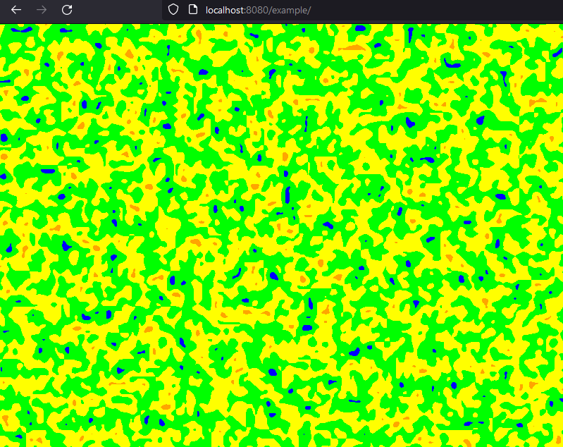

# Excalibur Perlin Noise

This is a small module that implements the original perlin noise implementation in Excalibur given the [original Siggraph paper](http://mrl.nyu.edu/~perlin/noise/)

You may want to use noise if you need "smooth" randomness from point to point. It's super useful for generating "natural" looking structures randomly.


## Usage

In your excalibur project run

`npm install @excaliburjs/plugin-perlin`


```typescript
import { PerlinGenerator } from '@excaliburjs/plugin-perlin';

const generator = new PerlinGenerator({
    seed: 515, // random seed
    octaves: 2, // number of times noise is laid on itself
    frequency: 24, // number of times the pattern oscillates, higher is like zooming out
    amplitude: 0.91, // [0-1] amplitude determines the relative height of the peaks generated in the noise
    persistance: 0.95 // [0-1] he persistance determines how quickly the amplitude will drop off, a high degree of persistance results in smoother patterns, a low degree of persistance generates spiky patterns.
});
```

You can use the generator to sample perlin noise with the given configuration.

* `generator.noise(x)` - Sample 1D noise, outputs a value [0, 1]
* `generator.noise(x, y)` - Sample 2D noise, outputs a value [0, 1]
* `generator.noise(x, y, z)` - Sample 3D noise, , outputs a value [0, 1]
* `generator.sequence(length, optionalStep)` - Generates a list of 1D noise starting at 0 and ending at 1 of continuous perlin noise, by default the step is 1/length;
* `generator.grid(width, height, optionalStep)` - Generates a 2D grid as a packed array of perlin noise given a step value packed into a 1D array i = (x + y*width), by default the step will 1/(min(dimension))


### Perlin Drawing


If you want to draw perlin noise directly there is a helper `PerlinDrawer2D` which can be used to draw to a `Canvas` or output an HTML Image.

```typescript
// Create a perlin drawer and pass a generator
// Optionally pass a color function that takes a sample value [0, 1] and produces a Color
const drawer = new PerlinDrawer2D(generator, (value: number) => {
    const rainbow = [
        ex.Color.Red,
        ex.Color.Orange,
        ex.Color.Yellow,
        ex.Color.Green,
        ex.Color.Blue,
        ex.Color.Violet
    ]
    const colorIndex = Math.floor((val * rainbow.length));
    return rainbow[colorIndex];
});

const canvas = new ex.Canvas({
    width: 800,
    height: 600,
    cache: true,
    draw: (ctx) => {
        // Generating perlin noise expensive
        drawer.draw(ctx, 0, 0, 800, 600);
    }
});
const actor = new ex.Actor({x: 0, y: 0, width: 800, height: 600});
actor.graphics.use(canvas);
actor.graphics.anchor = ex.Vector.Zero;
game.add(actor);
```




Here is an example of HTML image output, this can be used as an upload to an Excalibur `Material` or other `ImageSource`.

```typescript
const drawer = new PerlinDrawer2D(generator, (value: number) => {
    const rainbow = [
        ex.Color.Red,
        ex.Color.Orange,
        ex.Color.Yellow,
        ex.Color.Green,
        ex.Color.Blue,
        ex.Color.Violet
    ]
    const colorIndex = Math.floor((val * rainbow.length));
    return rainbow[colorIndex];
});

const image = drawer.image(200, 200);
document.body.appendChild(image);
```